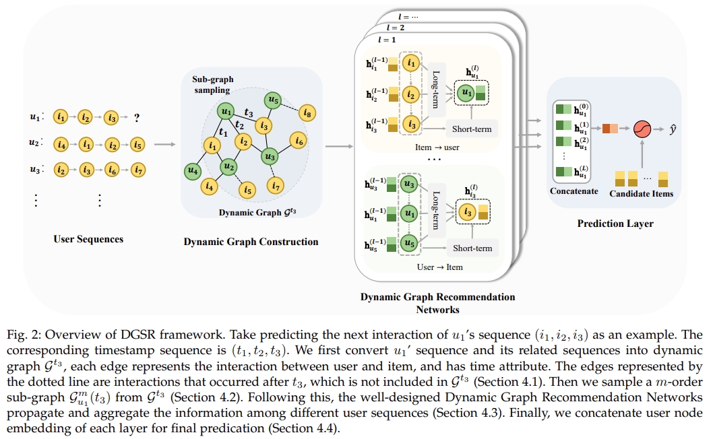

# DGSR



This is the code for the TKDE 2022 Paper: [Dynamic Graph Neural Networks for Sequential Recommendation](https://ieeexplore.ieee.org/abstract/document/9714053).

## Usage

### Generate data

You need to run the file ```new_data.py``` to generate the data format needed for our model. The detailed commands 
can be found in ```load_{dataset}.sh```

You need to run the file ```generate_neg.py``` to generate data to speed up the test. You can set the 
data set in the file.

### Training and Testing 

Then you can run the file ```new_main.py``` to train and test our model. 
The detailed commands can be found in ```{dataset}.sh```


## Requirements

- Python 3.6
- torch 1.7.1
- dgl 0.7.2

## Citation

Please cite our paper if you use the code:

```
@ARTICLE{9714053,
  author={Zhang, Mengqi and Wu, Shu and Yu, Xueli and Liu, Qiang and Wang, Liang},
  journal={IEEE Transactions on Knowledge and Data Engineering}, 
  title={Dynamic Graph Neural Networks for Sequential Recommendation}, 
  year={2022},
  volume={},
  number={},
  pages={1-1},
  doi={10.1109/TKDE.2022.3151618}}
```

